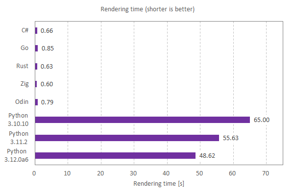

# Py-MeltySynth

Py-MeltySynth is a SoundFont MIDI synthesizer written in pure Python, ported from [MeltySynth for C#](https://github.com/sinshu/meltysynth).
I believe this is the first fully functional SoundFont synthesizer made with Python without external libraries.


## Features

* Support for standard MIDI files.
* No dependencies other than the standard library.
* All the functionality is in a single file. Simply copy [the file](meltysynth.py) into your project and you are ready to go.


## Demo

https://www.youtube.com/watch?v=Pheb0pSzQP8  

[](https://www.youtube.com/watch?v=Pheb0pSzQP8)


## Development status

It works, but it's slow. Without external libraries, sample-by-sample audio processing seems tough for Python...
But Python is said to be becoming more performance oriented, so it should be useful in the future.

Below is a comparison of the time it took to render a MIDI file in several languages.
The MIDI file is [flourish.mid](https://midis.fandom.com/wiki/Flourish) (90 seconds) and the SoundFont used is [TimGM6mb.sf2](https://musescore.org/en/handbook/3/soundfonts-and-sfz-files#gm_soundfonts).
Python is still slow, but it is certainly improving in speed as the versions go up.




## Examples

An example code to synthesize a simple chord:

```python
import meltysynth as ms

# Load the SoundFont.
sound_font = ms.SoundFont.from_file("TimGM6mb.sf2")

# Create the synthesizer.
settings = ms.SynthesizerSettings(44100)
synthesizer = ms.Synthesizer(sound_font, settings)

# Play some notes (middle C, E, G).
synthesizer.note_on(0, 60, 100)
synthesizer.note_on(0, 64, 100)
synthesizer.note_on(0, 67, 100)

# The output buffer (3 seconds).
left = ms.create_buffer(3 * settings.sample_rate)
right = ms.create_buffer(3 * settings.sample_rate)

# Render the waveform.
synthesizer.render(left, right)
```

Another example code to synthesize a MIDI file. It will take a long time 😉

```python
import meltysynth as ms

# Load the SoundFont.
sound_font = ms.SoundFont.from_file("TimGM6mb.sf2")

# Create the synthesizer.
settings = ms.SynthesizerSettings(44100)
synthesizer = ms.Synthesizer(sound_font, settings)

# Load the MIDI file.
midi_file = ms.MidiFile.from_file("flourish.mid")

# Create the MIDI sequencer.
sequencer = ms.MidiFileSequencer(synthesizer)
sequencer.play(midi_file, False)

# The output buffer.
left = ms.create_buffer(int(settings.sample_rate * midi_file.length))
right = ms.create_buffer(int(settings.sample_rate * midi_file.length))

# Render the waveform.
sequencer.render(left, right)
```


## Todo

* __Wave synthesis__
    - [x] SoundFont reader
    - [x] Waveform generator
    - [x] Envelope generator
    - [x] Low-pass filter
    - [x] Vibrato LFO
    - [x] Modulation LFO
* __MIDI message processing__
    - [x] Note on/off
    - [x] Bank selection
    - [x] Modulation
    - [x] Volume control
    - [x] Pan
    - [x] Expression
    - [x] Hold pedal
    - [x] Program change
    - [x] Pitch bend
    - [x] Tuning
* __Effects__
    - [ ] Reverb
    - [ ] Chorus
* __Other things__
    - [x] Standard MIDI file support
    - [ ] Loop extension support
    - [ ] Performace optimization


## License

Py-MeltySynth is available under [the MIT license](LICENSE.txt).
